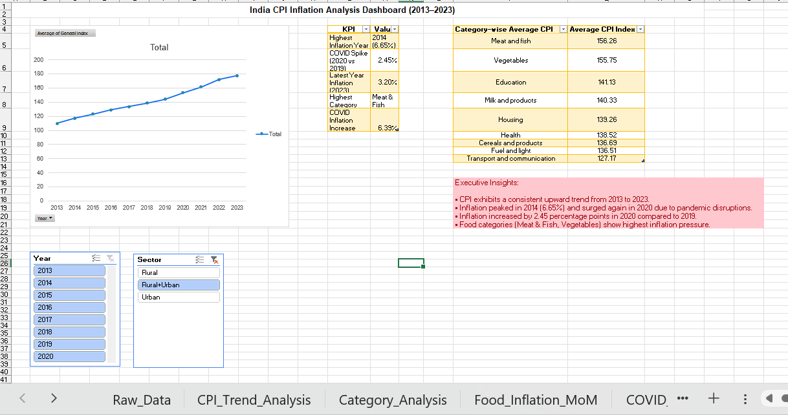

# India CPI Inflation Analysis Dashboard (Excel)

## Project Overview
This project analyzes India's Consumer Price Index (CPI) inflation trends from 2013 to 2023 using Advanced Excel. The dashboard highlights inflation trends, category contributions, food inflation patterns, and COVID-19 impact.

## Objectives
• Identify overall CPI inflation trends  
• Analyze category-wise contribution to inflation  
• Perform food inflation Month-on-Month analysis  
• Evaluate COVID-19 impact on inflation  
• Build interactive Excel dashboard  

## Key Insights
• CPI shows consistent upward trend from 2013 to 2023  
• Highest inflation observed in 2014 (6.65%)  
• COVID-19 caused significant inflation increase (6.39%)  
• Food categories contributed most to inflation  
• Highest food inflation MoM occurred in Oct 2022 (1.01%)

## Tools Used
• Microsoft Excel  
• Pivot Tables  
• Pivot Charts  
• Dashboard Design  
• Data Analysis  

## Files Included
• India_CPI_Inflation_Analysis_Dashboard_Excel.xlsx — Full project  
• Dashboard.png — Dashboard preview  

## Skills Demonstrated
• Data Cleaning  
• Data Analysis  
• KPI Creation  
• Dashboard Building  
• Business Insights Generation  

---

This project is part of my Data Analyst portfolio.
